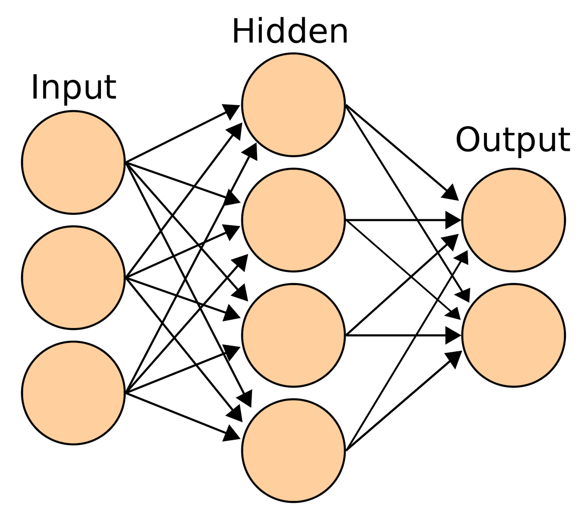

# GenAI Essentials

1. [NLP](https://github.com/DasikaMadhu/GenAI/blob/main/gen-essentials.ipynb?#NLP)
2. [Regression](https://github.com/DasikaMadhu/GenAI/blob/main/gen-essentials.ipynb?#Regression)
3. [Classification](https://github.com/DasikaMadhu/GenAI/blob/main/gen-essentials.ipynb?#Classification)
4. [Clustering](https://github.com/DasikaMadhu/GenAI/blob/main/gen-essentials.ipynb?#Clustering)
5. [Association](https://github.com/DasikaMadhu/GenAI/blob/main/gen-essentials.ipynb?#Association)
6. [Dimensionality Reduction](https://github.com/DasikaMadhu/GenAI/blob/main/gen-essentials.ipynb?#Dimensionality-Reduction)
7. [Types of Machine Learning](https://github.com/DasikaMadhu/GenAI/blob/main/gen-essentials.ipynb?#Types-of-Machine-Learning)
8. [Classical ML](https://github.com/DasikaMadhu/GenAI/blob/main/gen-essentials.ipynb?#Classical-Machine-Learning)
9. [Differences among SL, UL & RL](https://github.com/DasikaMadhu/GenAI/blob/main/gen-essentials.ipynb?#Differences-between-Supervised-Learning,-Unsupervised-Learning-&-Reinforcement-Learning)
10. [Neural Networks and Deep Learning](https://github.com/DasikaMadhu/GenAI/blob/main/gen-essentials.ipynb?#Neural-Networks-and-Deep-Learning)
11. [BERT](https://github.com/DasikaMadhu/GenAI/blob/main/gen-essentials.ipynb?#BERT)

### NLP 

1. Text Wrangling & Preprocessing
    1. Conversion - Converting uppercase to lowercase, contractions to full forms, etc
    2. Sanitization - Removing HTML code or stop words or special characters
    3. Tokenization - Converting text into vector embeddings
    4. Stemming - Reducing words to their base or root form by cuting off prefixes and suffixes, i.e., affixes
    5. Lemmatization - Reducing words to their base or dictionary form
2. Language Understanding (Syntax & Structure)
    1. Parts of Speech (POS) Tagging - Giving each word a particular part of speech (adverb, adjective, verb, etc.) or grammatical category
    2. Chunking - Identify parts of speech and short phrases present in a given sentence
    3. Dependency Parsing - Examining the dependencies between the phrases of a sentence in order to determine its grammatical structure
    4. Constituency Parsing - Identifying the constituents, or subparts, of a sentence and the relationships between them, represented in a hierarchical structure
4. Processing & Functionality
    1. Named Entity Recognition (NER) - Identifying and classifying named entities in unstructured text, like people, organizations, locations, dates, and other relevant information
    2. N-gram Identification - Analyzing text by breaking it into sequences of N consecutive words or characters to capture context and patterns in language
    3. Sentiment Analysis - Determining whether a piece of text expresses a positive, negative, or neutral sentiment
    4. Information Extraction - Extracting structured information (e.g., entities, relationships, or facts) from unstructured text
    5. Information Retrieval - Searching and retrieving relevant information or documents from a large dataset or database based on a user query
    6. Question Answering - Providing precise answers to user queries by understanding context and retrieving relevant information
    7. Topic Modelling - Identifying underlying topics in a collection of documents by grouping related words and concepts

### Regression 

* *Regression* is a statistical and machine learning technique used to model and analyze relationships between dependent and independent variables.
* A *regression line* is the straight line that best fits the data points in a scatter plot, representing the predicted values of the dependent variable.
* *Error* refers to the difference between the predicted and actual values, often minimized to improve the model.
* *Distance* in regression measures how far a prediction is from the actual data point, often represented by metrics like Euclidean distance.
* Regression represents input features as *vectors* in multidimensional space, where the model learns a function to map these vectors to the target.
* Common regression algorithms include Simple Linear Regression, Multiple Linear Regression, Polynomial Regression, Lasso Regression, Ridge Regression, Decision Tree Regression, Random Forest Regression, and Support Vector Regression (SVR).
* Examples - Predicting house prices (linear regression), stock prices (time-series regression), and customer lifetime value (logistic regression for binary cases).

### Classification 

* *Classification* is a machine learning task where the goal is to assign a label or category to a given input based on its features.
* A *classification line* (or decision boundary) is a boundary that separates different classes in a feature space, typically used in algorithms like logistic regression or support vector machines.
* A *category* refers to the distinct labels or classes that data points can be assigned to in a classification problem, such as "spam" vs. "not spam."
* Common classification algorithms include Logistic Regression, Decision Trees, Random Forest, Support Vector Machine (SVM), Kernel SVM, K-Nearest Neighbors (KNN), Naive Bayes, XGBoost, and AdaBoost.
* Examples - Email spam detection, image classification (e.g., cat vs. dog), and medical diagnosis (e.g., disease or no disease).

### Clustering 

* *Clustering* is an unsupervised machine learning technique that groups similar data points together based on shared features, without predefined labels.
* Clustering is useful for exploring data patterns, discovering hidden structures, and reducing dimensionality, often applied in anomaly detection and recommendation systems.
* Common clustering algorithms include K-means, K-medoids, DBSCAN, and hierarchical clustering.
* Examples - Customer segmentation in marketing, grouping news articles by topics, and organizing images based on visual similarity.

### Association

* *Association* is a rule-based machine learning technique used to discover interesting relationships, patterns, or dependencies among items in large datasets.
* An association rule represents an "if-then" relationship, such as "if a customer buys bread, they are likely to buy butter".
* Support refers to the proportion of transactions containing a specific item or itemset in the dataset.
* Confidence measures how often the rule has been found to be true in the dataset, given the antecedent is present.
* Lift indicates the strength of a rule by comparing its confidence to the expected confidence if the items were independent.
* Common association algorithms include Apriori, Eclat, and FP-Growth.
* Examples - Market basket analysis (e.g., "people who buy diapers also buy beer"), cross-selling strategies, and website clickstream analysis.

### Dimensionality Reduction

* *Dimensionality Reduction* is a technique used to reduce the number of features or variables in a dataset while preserving as much relevant information as possible.
* Often used as a pre-processing stage. 
* Feature selection techniques, such as filter, wrapper, and embedded methods, identify the most relevant features in the data.
* Dimensionality reduction helps address issues like the "curse of dimensionality" and improves computational efficiency for high-dimensional data.
    * Common algorithms include Principal Component Analysis (PCA), Linear Discriminant Analysis (LDA), Generalized Discriminant Analysis (GDA), Singular Value Decomposition (SVD), Latent Dirichlet Allocation (LDA), and t-SNE.
* Examples - Reducing features in gene expression datasets, image compression, and improving clustering or classification on high-dimensional data.

### Types of Machine Learning 

##### Learning Problems
1. Supervised - Training a model on labeled data, where the model learns to map inputs to known outputs
2. Unsupervised - Training a model on unlabeled data, where the model identifies patterns and structures in the data without predefined labels
3. Reinforcement - Training an agent to make decisions by interacting with an environment and receiving rewards or penalties based on actions

##### Hybrid Learning Problems
1. Semi-supervised - Combining very limited labeled and large number of unlabeled data to train a model, leveraging the labeled data for better performance
2. Self-supervised - Generating labels from the input data itself, using parts of the data to predict other parts, where the model is pre-trained on unlabeled data by automatically generating labels that are further used as ground truths in subsequent iterations
3. Multi-instance - Training a model with labeled bags of instances, where the label is assigned to the entire bag, not individual instances

##### Statistical Inference 
1. Inductive - Drawing general conclusions from specific observations, often used to build models that generalize well to new data
2. Deductive - Using general rules or premises to make specific predictions or conclusions, often relying on established theories or frameworks
3. Transductive - Making predictions for specific test instances based on observed training data, without generalizing to all possible cases

##### Learning Techniques 
1. Multi-task - Training a model on one dataset to perform multiple related tasks simultaneously, sharing common representations to improve overall performance
2. Active - Interactively queries a user to select the most informative data points from unlabeled data for labeling, enabling it to achieve higher accuracy with fewer labeled examples
3. Online - Training a model incrementally as new data becomes available, allowing it to adapt continuously over time, before a prediction is required or after the last observation
4. Transfer - Leveraging knowledge from a pre-trained model on one task to improve performance on a related task
5. Ensemble - Combining multiple models to improve predictions, often by averaging their outputs or using a voting mechanism to reduce overfitting and increase accuracy

### Division of Machine Learning

1. Classical ML - Simple data, clear features, cost efficient
   1. Supervised
   2. Unsupervised
2. Reinforcement Learning - When there is no data, the model will figure out what to do through trial and error
   1. Real-time decision making
   2. Game AI
   3. Learning Tasks
   4. Robot Navigation 
3. Ensemble Methods - When the quality of the data is a problem
   1. Bagging
   2. Boosting
   3. Tagging
4. Deep Learning / Neural Networks - When the data is complicated and/or features are unclear
   1. Convolutional Neural Networks (CNN)
   2. Recurrent Neural Networks (RNN)
   3. Generative Adversarial Networks (GAN)
   4. Multilayer Perceptron (MLP)

### Classical Machine Learning

#### Supervised Learning (SL)
* Data that has been labelled into categories
* Task-driven
* Goal is to make a prediction

Classification - Predict what cetegory does the variables belong to (Identity Fraud Detection)
Regression - Predict the target variable in the future (Market Forecast)

#### Unsupervised Learning (UL)
* Data is not labelled
* Data-driven
* Goal is to recognise a structure or pattern

Clustering - Group data based on their similarities or differences (Targeted Marketing)
Association - Find a relationship between variables through association (Customer Recommendation)
Dimensionality Reduction - Helps in reducing the amount of data pre-processing (Big Data Visualization)

##### Differences between Supervised Learning, Unsupervised Learning & Reinforcement Learning
| Supervised Learning | Unsupervised Learning | Reinforcement Learning |
|------------------|------------------|------------------|
| An ML task or function that needs training data to predict the outcome. | An ML task or function trains on unlabelled training data to predict the outcome. | There is no data, an ML model generates data in an attempt to reach a goal. |
| The ML model learns from labelled training data. | The ML model uses unlabelled data to to identify patterns or structures and applies its own labels. | The ML model is deployed within an environment and works on a decision-driven trial and error principle. |
| More accurate than UL | Requires human intervention in validating the predicted outcomes | Dynamic and adapts over time to maximize long-term rewards |
| Classification, Regression | Clustering, Association, Dimensionality Reduction | Real-time decision making, Game AI, Learning Tasks, Robot Navigation |

### Neural Networks and Deep Learning

#### Neural Networks 
* Mimics the brain.
* A neuron / node represents an algorithm.
* Data input to a neuron and based on the ouput, the data will be passed to other connected neurals.
* The connection between neurons is weighted.
* The network is organized in layers - an input layer, multiple hidden layers and an output layer.

#### Deep Learning 
* A neural network that has 3 or more hidden layers.
* *Feed Forward neural network* (FNN) - Connections between nodes do not form a cycle and always move forward
* *Back Propogation* (BP) - Moving backward, to learn, through the neural network adjusting weights to improve the outcome on the next iteration
* *Ground truth* - Labelled data that is known to be correct
* *Error rate* - How bad the network performed
* *Loss Function* - A function that compares the ground truth to the prediction to determine the error rate
* *Activation Functions* - An algorithm applied to a hidden layer node that affects the connected ouput
* *Dense* - The next layer increases the number of nodes
* *Sparse* - The next layer decreases the amount of nodes

##### Deep Learning Algorithms 
1. Supervised
    * Fully-connected Feed Forward Networks (FNN)
    * Recurrent Neural Networks (RNN)
    * Convolutional Neural Networks (CNN)
2. Unsupervised
    * Deep Belief Networks (DBN)
    * Stacked Auto Encoders (SAE)
    * Restricted Boltzmann Machines (RBMs)
  
### [BERT](https://huggingface.co/docs/transformers/model_doc/bert)

- *Bidirectional Encoder Representations* (BERT) from Transformers.
- Encoder-only models.
- Misnomer (mainly non-directional) - It takes in all of the data at once (does not read right to left or left to right).
- Reads the text from right to left and left to right to understand the context, and the sequence of words matters.
- Taking the transformer architecture, stack the encoders to get BERT.
- It highlights certain words based on their association with other words (nuances - when one word enhances another).
- It assigns priority to words based on the understanding it has of language.
- It is contextually aware of each word and its importance in a sentence.
- The parameter size is constant before training, and their weights are initialized randomly.
- Estimates how off it is and readjusts the weights accordingly until the error margin is minimized.
- Post-training, the parameters have a representation of the data it trained on.
- Pre-trained on
    1. Masked Language Model (MLM) 
        - Provide input where tokens are masked.  
        - Fill in the blanks for sentences.  
    2. Next Sentence Prediction (NSP)
        - Provide two sentences A and B.  
        - Predict if B would follow A.  
- Multiple model sizes
    - Base – 100M parameters (12 layers, 12 attention heads, hidden size of 768)
    - Large – 240M parameters (24 layers, 16 attention heads, hidden size of 1024) 
    - Tiny – 4M parameters (2 layers, 2 attention heads, hidden size of 128)
- Fine-tune to perform
    1. Named Entity Recognition (NER)
    2. Question Answering (QA) 
    3. Sentence Pair Tasks  
    4. Summarization
    5. Feature Extraction / Embeddings 
    6. Classification of text
    7. Sentiment analysis
- BERT Variants
    - RoBERTa 
    - DistilBERT 
    - ALBERT
    - ELECTRA 
    - DeBERTa 
- Very useful for a specific task or reaching a specific conclusion from a piece of text.

- Transformers come in two pieces - encoder and decoder (natural language into mathematical representation and vice versa).  
- First-gen LLMs had an encoder-decoder couple.  
- GPTs are decoder-only.  
- Encoder-only models take in natural language and return mathematical representations.  
- RNNs are designed to have sequential understanding and process sequential data.  
- With the transformer architecture, the sequence changes and the understanding changes. 
- Emergent tasks - Capabilities that arise spontaneously from the model’s scale and training data, enabling it to perform complex functions—such as reasoning, translation, or coding—without explicit programming or task-specific training.
- The bigger the model size, the more number of emergent tasks it has.
- Embedding refers to the numerical representation of input text that captures semantic meaning.
    - Token Embeddings – Convert each word or subword (WordPiece token) into a dense vector.
    - Position Embeddings – Encode the position of each token in the sequence to maintain word order.
    - Segment Embeddings – Distinguish between sentences in tasks like next-sentence prediction.
- [Chinchilla Training Compute-Optimal Large Language Models](https://arxiv.org/abs/2203.15556)
    - The bigger the model, the more information it can understand.
    - The bigger the model, the more data it needs.
    - Research outcome - Many models are overparameterized and undertrained (a lot of connections between nodes, but the amount of passes going through is too few).
    - The dataset and token should be 20 times the number of parameters.
- The models have the same size, but the parameter size differs based on the weights assigned.
- The file size changes due to the system attaching metadata of the model training states.
- Optimize models by pruning or teacher-student model (knowledge distillation).

